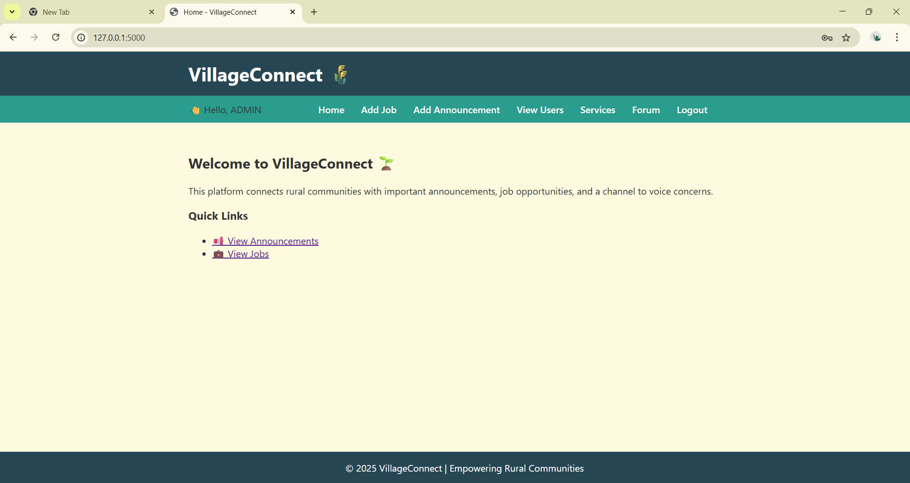
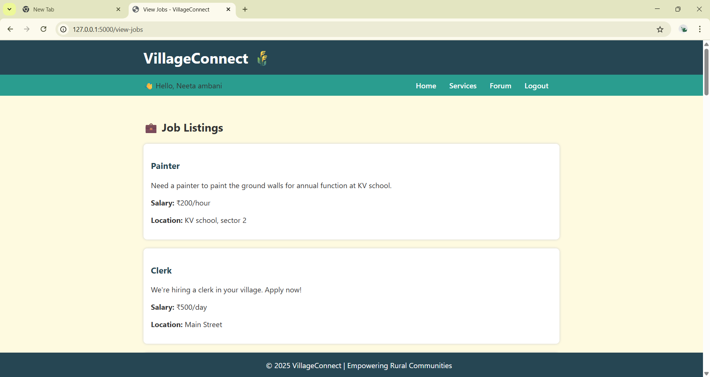
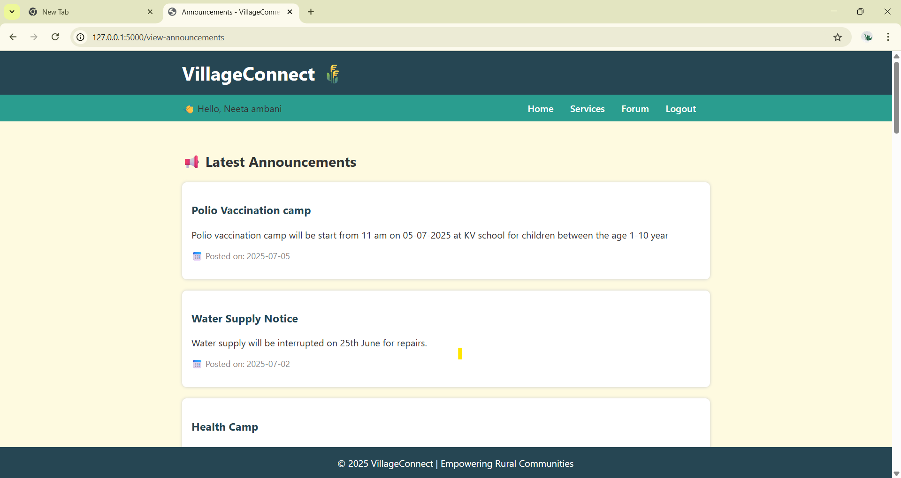
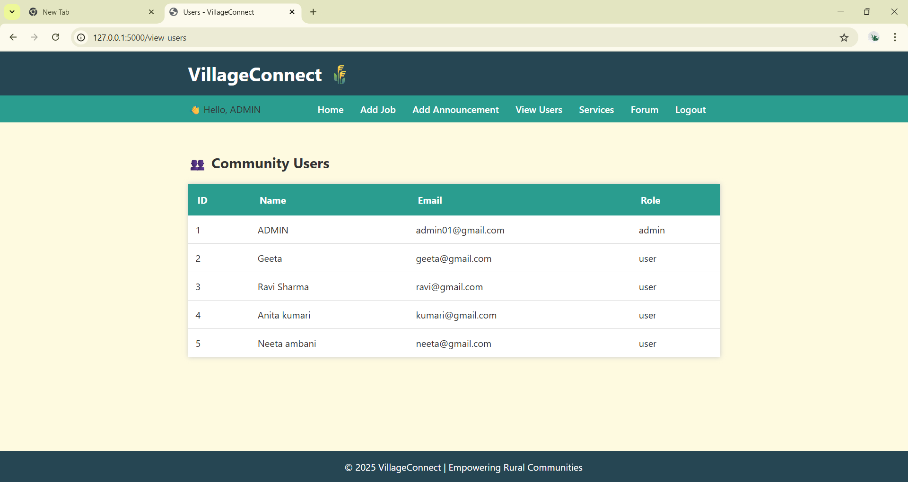
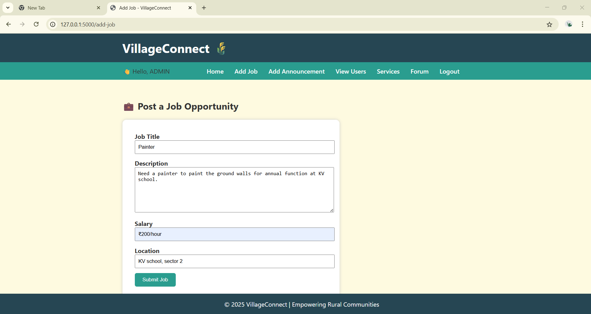
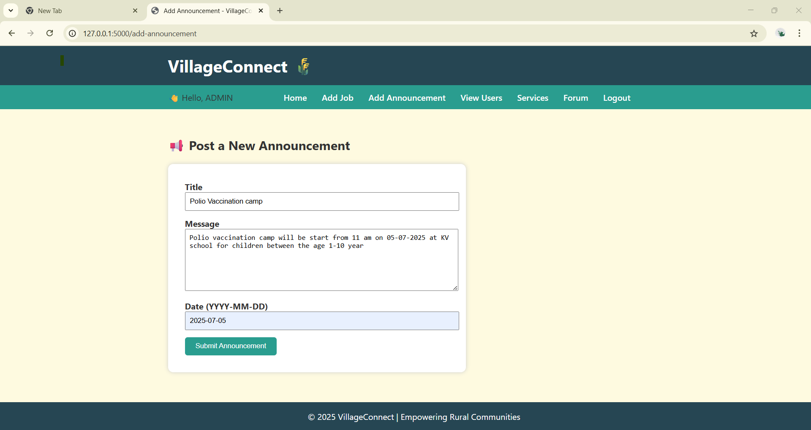
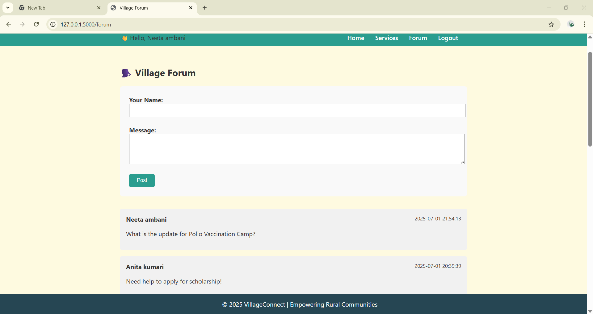
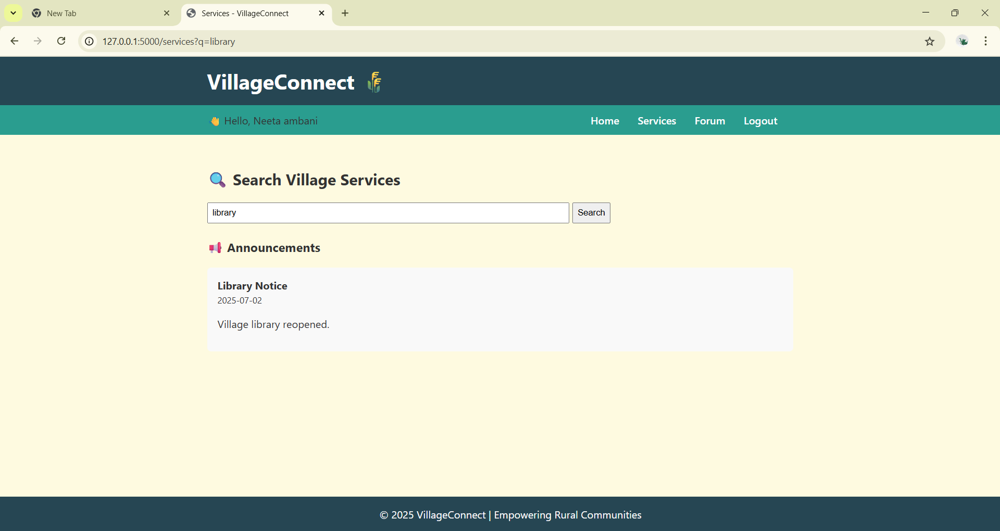

# 🏡 VillageConnect - A Rural Community Support Platform

VillageConnect is a Flask-based web application designed to support rural communities by managing and sharing jobs, announcements, public services, and community discussions. It includes secure admin/user login, role-based access, and a community forum.

---

## 🌟 Features

- 👤 Admin & User Login with Role-Based Access
- 📢 Add & View Announcements *(Admin only)*
- 💼 Add & View Jobs *(Admin only)*
- 👥 View Users *(Admin only)*
- 🧾 Forum to post messages *(All logged-in users)*
- 🔐 Protected Routes: Only accessible when logged in
- 📂 SQLite database with realistic seeded data
- 🧑‍💻 REST API support via Postman (GET, POST, DELETE)
- 📱 Responsive UI with clean layout

---

## 🔧 Technologies Used

- Python + Flask
- SQLite
- HTML5 + Jinja Templates
- Bootstrap (for layout styling)
- Werkzeug (password hashing)
- Postman (API testing)

---

## 🚀 Setup Instructions

1. **Clone the repository**
   ```bash
    git clone https://github.com/Uttarab04/villageconnect.git
    cd villageconnect
2. **Create virtual environment (optional but recommended)**
   ```bash
   python -m venv venv
   source venv/bin/activate  # or venv\Scripts\activate (Windows)
3. **Install dependencies**
   ```bash
   pip install -r requirements.txt
4. **Run the app**
   ```bash
   python app.py
5. **Visit the app**
   ```bash
   http://127.0.0.1:5000

---

## 🔐 Demo Credentials
# 👤 Admin Login

- Email: admin01@gmail.com
- Password: ADMIN@01

You can also sign up as a regular user from the /signup page.

---

## 📸 Screenshots

### 🏠 Home Page


### 💼 View Jobs


### 📢 View Announcements


### 👥 View Users (Admin only)


### ➕ Add Job


### ➕ Add Announcement


### 🧾 Forum


### 🧾 Services


---

## 🧠 Developer Notes

- The project is divided into app.py, templates/, and dev-tools/ for setup scripts.

- Dummy data and admin seeding is done via:

- dev-tools/seed_data.py

- dev-tools/seed_admin.py

*REST API routes include:*

 - GET /jobs, POST /jobs

 - GET /announcements, POST /announcements

 - DELETE /jobs/<id>, DELETE /announcements/<id>

---

## 📬 Contact
Developed by Uttara Balpande
Connect on LinkedIn: *https://www.linkedin.com/in/uttara-balpande-a6924a2a0/*